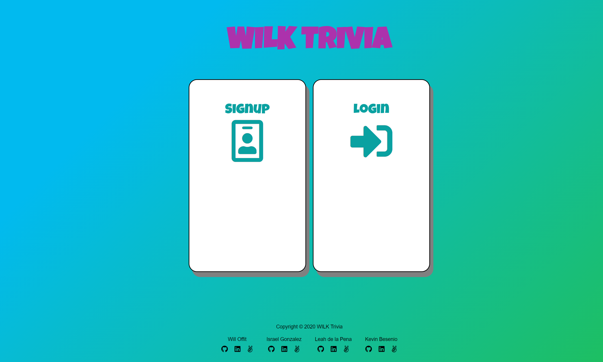

<h1 align="center">WILK Trivia</h1>

   

# Table of Contents
* <a href="#introduction">Introduction</a>
* <a href="#technologies">Technologies</a>
* <a href="#features">Features</a>
* <a href="#challenges">Challenges</a>
* <a href="#futurefeatures">Future Features</a>

# Introduction
[WILK Trivia](https://wilk-trivia.herokuapp.com/#/)

# Technologies
-	MongoDB
-	Express.js
-	React
-  Redux
-	Node.js
-	Heroku

# Features

# Challenges

# Future Features
